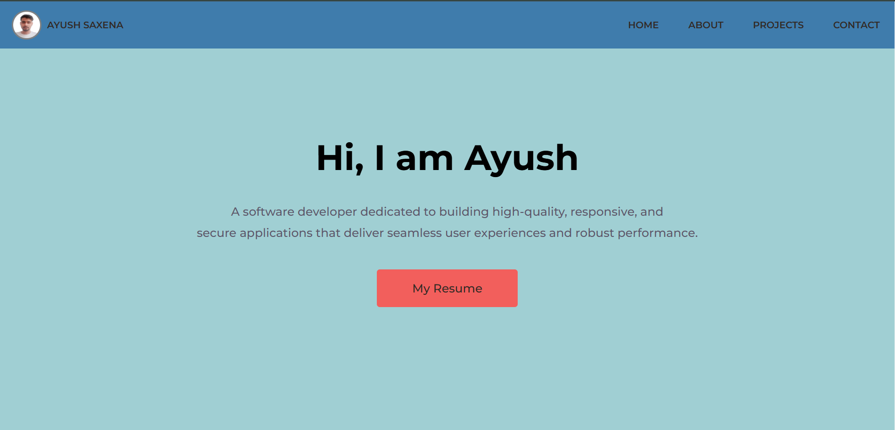
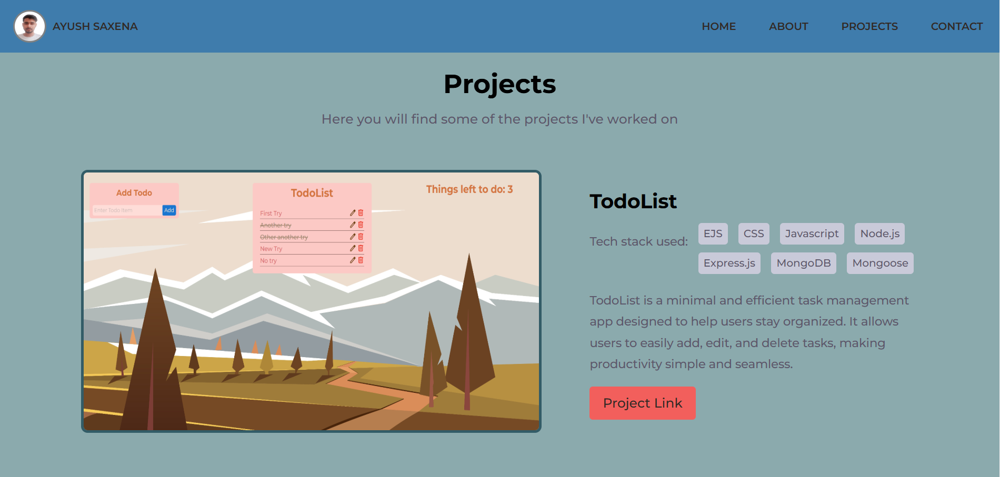
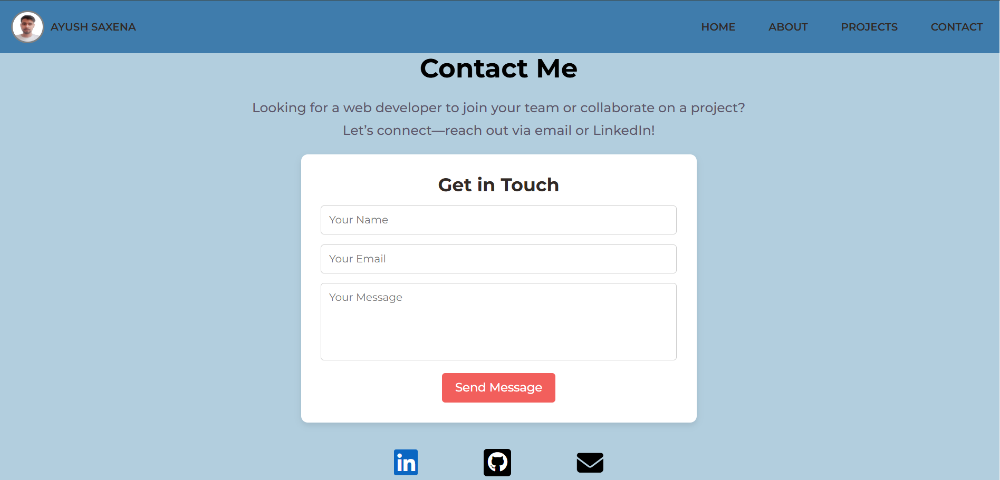

# My Portfolio

A personal portfolio website showcasing my skills, projects, and contact information.

**Live Project:** [ayushsaxena.onrender.com](https://ayushsaxena.onrender.com)

## Screenshots

### Hero Section  
  

### About Section  
  

### Projects Section  
  

### Contact Section  
  

## How It's Made

**Tech Stack:**  
- **Frontend:** HTML, CSS, JavaScript  

This portfolio is built entirely from scratch, using **HTML** for structure, **CSS** for styling, and **JavaScript** for interactivity. The custom design ensures a unique and personalized user experience.  

## Optimizations

- **Performance Enhancements:**  
  - Minified CSS and JavaScript files to improve load times.  
  - Implemented lazy loading for images to enhance page speed.  
- **Accessibility Improvements:**  
  - Used semantic HTML elements for better screen reader compatibility.  
- **Future Improvements:**  
  - Will make it **fully responsive** for better usability across devices.  

## Lessons Learned

Building this portfolio from scratch helped me improve my **frontend development** skills, focus on **clean design**, and optimize for **performance**. It also reinforced the importance of structuring content effectively to create an engaging user experience.
